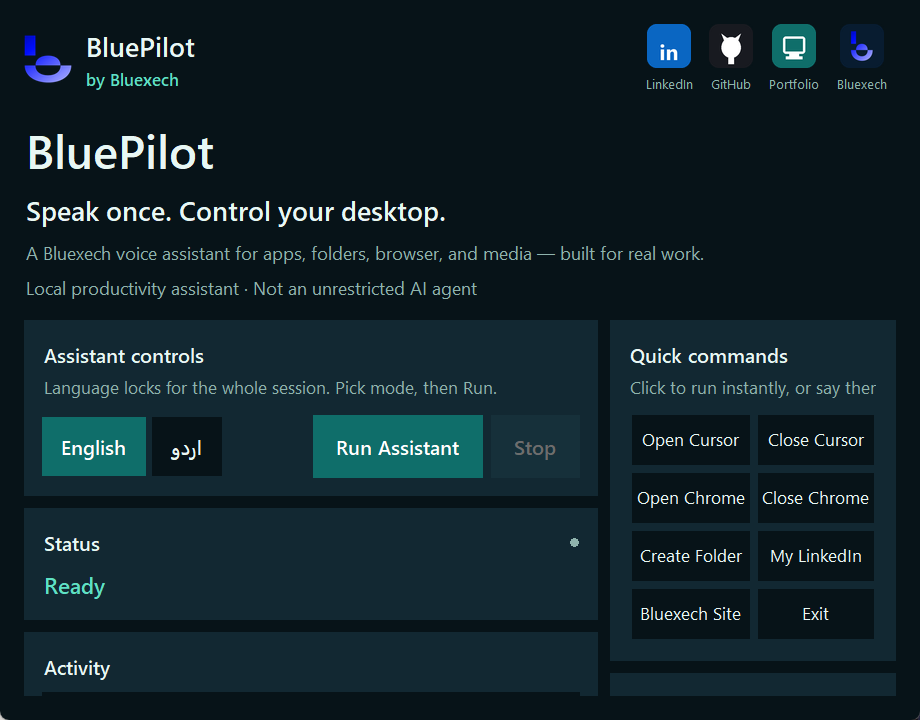

# BluePilot

**A Bluexech product** by **Muhammad Junaid**

> Speak once. Control your desktop.  
> Don’t touch the keyboard — just give a voice order, and your work gets done.

<p align="center">
  
</p>

<p align="center">
  <strong>English · اردو · Roman Urdu</strong><br/>
  Local desktop voice assistant for real productivity — not an unrestricted AI agent.
</p>

<p align="center">
  <a href="https://bluexech.com/">Bluexech</a> ·
  <a href="https://www.linkedin.com/in/muhammad-junaid-56b051282/">LinkedIn</a> ·
  <a href="https://github.com/junaid1233">GitHub</a> ·
  <a href="https://junaid-portfolio-mu.vercel.app/">Portfolio</a>
</p>

---

## UI Preview



---

## About

**BluePilot** is a voice-first Windows desktop assistant built under **Bluexech**.  
You speak in **English** or **Urdu** — BluePilot listens, understands the intent, and completes the task.

Built for developers and professionals who want faster desktop control without endless clicking.

---

## Highlights

- Polished **Run / Stop** product UI with live status + activity feed
- **Bilingual** listening & speaking (English + اردو)
- Voice-driven desktop automation (apps, browser, folders, media, windows)
- Quick command chips for instant actions
- Branded Bluexech experience with social links in header/footer
- Clean local architecture — productive, controlled, and explainable

---

## Tech Stack

| Layer | Tools |
| --- | --- |
| Language | Python 3.12+ |
| UI | Tkinter + Pillow |
| Speech-to-Text | SpeechRecognition + PyAudio (Google STT) |
| Text-to-Speech | edge-tts + pygame |
| Desktop automation | psutil, PyGetWindow, pyautogui, subprocess |
| Browser / media | webbrowser, pywhatkit |
| Config | python-dotenv |

---

## Requirements

- Windows 10/11
- Python 3.12+
- Working microphone
- Internet (for STT / TTS / YouTube music)

---

## Quick Start

```bash
cd Desktop-AI-Assistant
python -m venv .venv
.\.venv\Scripts\activate
pip install -r requirements.txt
copy .env.example .env
python run_ui.py
```

### CLI fallback (voice-only)

```bash
python -m app.main
```

---

## Configuration

Copy `.env.example` → `.env` and adjust if needed:

| Variable | Purpose |
| --- | --- |
| `ASSISTANT_NAME` | Product name (default: BluePilot) |
| `WAKE_WORD` | Wake phrase (default: bluepilot) |
| `LANGUAGE` | `en` or `ur` |
| `VOICE_EN` / `VOICE_UR` | Neural TTS voices |
| `LISTEN_TIMEOUT` / `PHRASE_TIME_LIMIT` | Mic listening windows |

> `.env` is gitignored — never commit API keys or private secrets.

---

## Language Modes

| Mode | STT | TTS |
| --- | --- | --- |
| English | `en-US` | `en-US-GuyNeural` |
| اردو | `ur-PK` | `ur-PK-UzmaNeural` |

Pick language in the UI, then press **Run Assistant**.  
Urdu bolo ya English — same workflow.

**Examples**

- EN: `Open Cursor` · `Create new folder` · `Open my LinkedIn profile` · `Exit`
- Roman: `cursor kholo` · `folder banao` · `mera linkedin kholo` · `band karo`
- UR: `کرسر کھولو` · `نیا فولڈر بناؤ` · `میرا لنکڈان کھولو` · `بند کرو`

Full list: see [`COMMANDS.md`](COMMANDS.md)

---

## Project Structure

```text
Desktop-AI-Assistant/
├── run_ui.py                 # Primary product entry (UI)
├── app/
│   ├── ui/                   # BluePilot product interface
│   ├── assistant/            # Voice loop + language switch
│   ├── commands/             # Command handlers + router
│   ├── services/             # Desktop, browser, folders, music...
│   ├── speech/               # Listener + speaker
│   ├── data/                 # apps.json, websites.json, music.json
│   ├── i18n.py               # Bilingual replies
│   └── config.py
├── assets/icons/             # Social brand icons
├── static/                   # Bluexech logo
├── docs/screenshots/         # README UI previews
├── COMMANDS.md               # Full voice command list
├── requirements.txt
├── .env.example
└── README.md
```

---

## How It Works

1. UI starts → choose **English** or **اردو**
2. Press **Run Assistant**
3. Speak a command (or use Quick command chips)
4. Intent is normalized (EN / Roman Urdu / Urdu script)
5. Router executes the matching desktop action
6. BluePilot replies by voice + activity log

---

## Disclaimer

BluePilot is a **local desktop automation / productivity product** from Bluexech.  
It is not a general chatbot and not an unrestricted autonomous agent. Use responsibly on your own machine.

---

## Author

**Muhammad Junaid**  
Full-Stack Developer & AI Engineer · **Bluexech**

| | |
| --- | --- |
| Company | [bluexech.com](https://bluexech.com/) |
| LinkedIn | [muhammad-junaid-56b051282](https://www.linkedin.com/in/muhammad-junaid-56b051282/) |
| GitHub | [junaid1233](https://github.com/junaid1233) |
| Portfolio | [junaid-portfolio-mu.vercel.app](https://junaid-portfolio-mu.vercel.app/) |

---

## License

Private / personal project unless otherwise stated by the author.

---

<p align="center">
  Built with focus by <strong>Muhammad Junaid</strong> · Product of <strong>Bluexech</strong>
</p>
